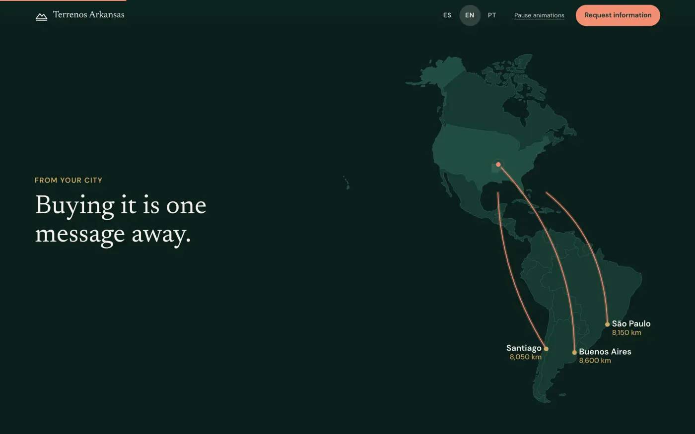
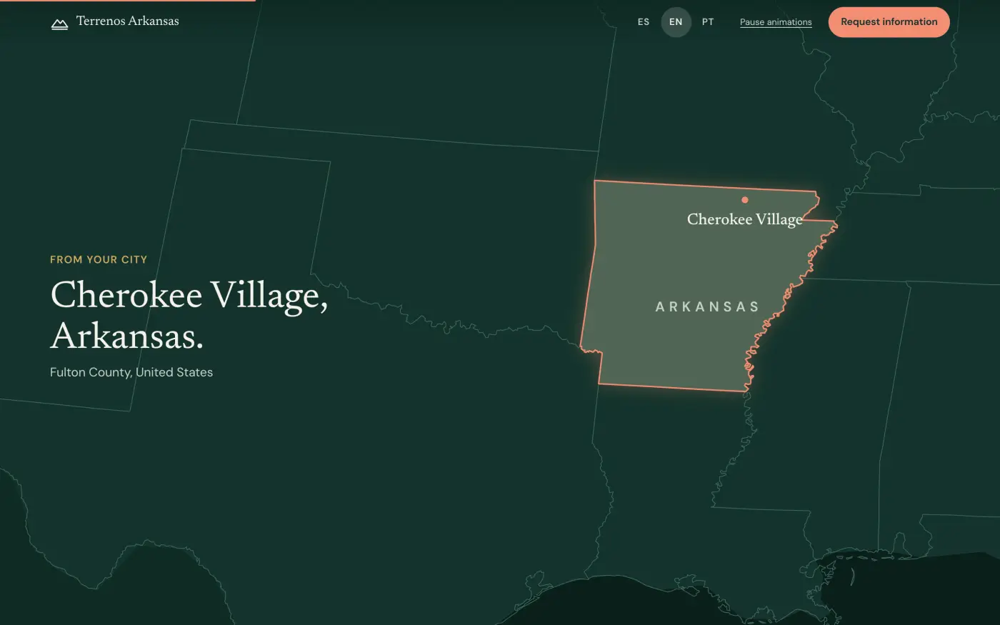
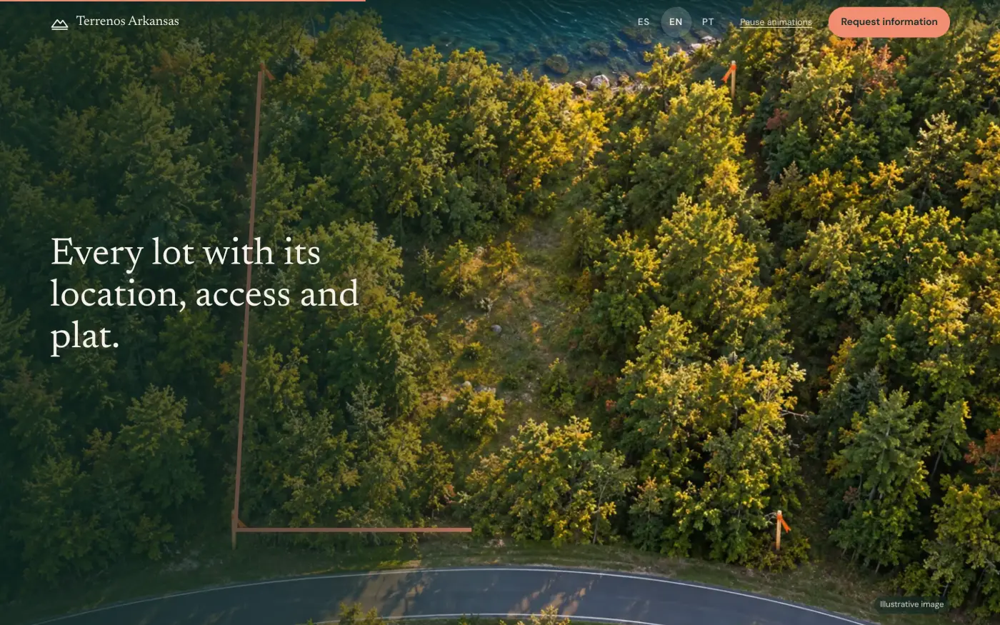
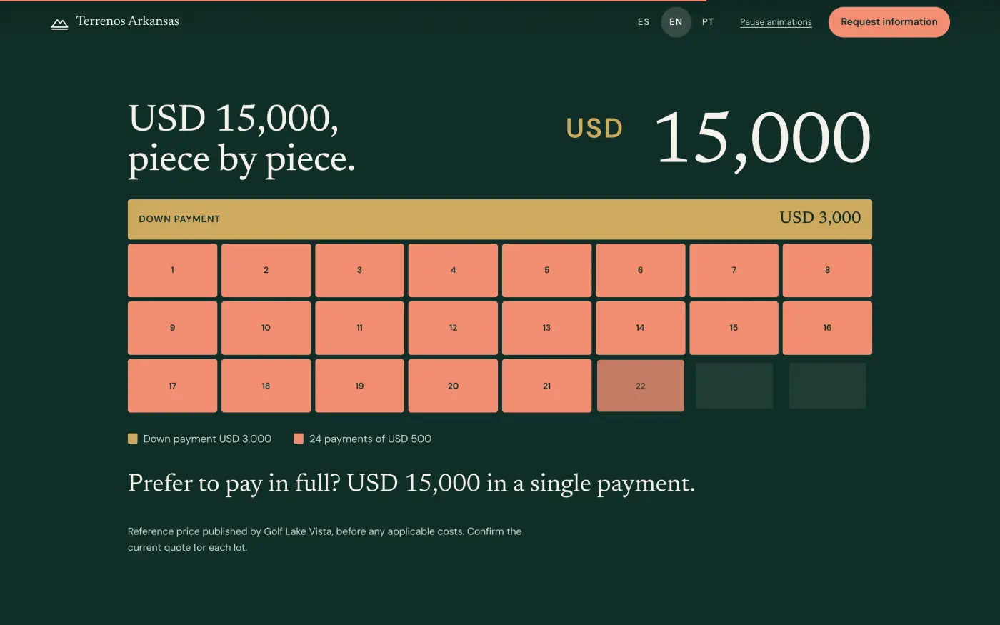
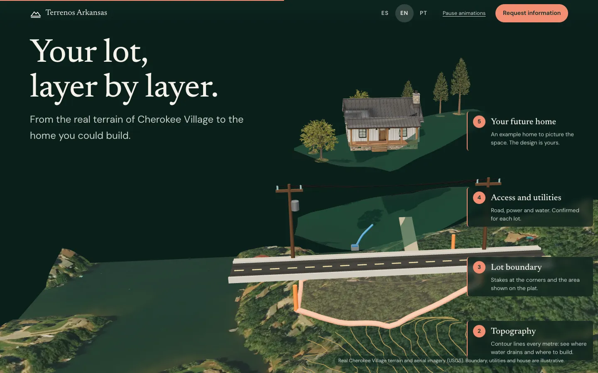
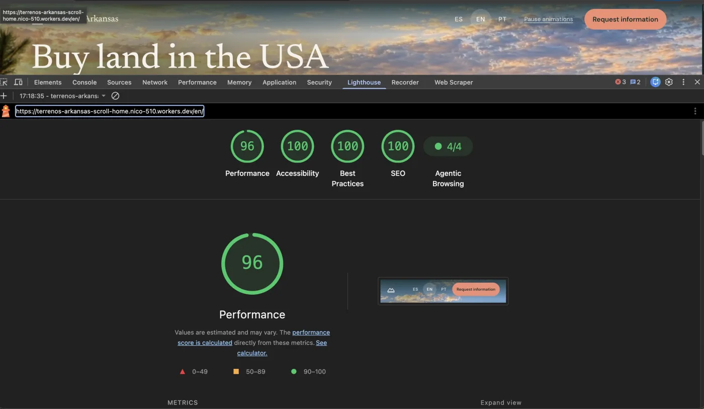

# ai-ranking-scroll-seo

**A Claude Code skill that builds premium scroll-driven websites that also rank.**

Most "wow" scroll sites are slow, invisible to Google and unreadable to AI
agents. This skill builds the cinematic version and then refuses to call it
done until it passes five hard gates: WebP images inside byte budgets, correct
schema, the researched keyword in the title and H1, Lighthouse 95+ on all four
scores (mobile and desktop), and agentic browsing readiness.


*A real site built with this skill, scrolled top to bottom.
[Watch it in full quality (MP4)](https://github.com/NicoSKOOL/ai-ranking-scroll-seo/releases/download/v1.1.0/terrenos-arkansas-scroll.mp4)
or [open the live site](https://terrenos-arkansas-scroll-home.nico-510.workers.dev/en/).*

## What it does

You describe the business. Claude runs a fixed process:

1. **Interview and brief.** Eight short questions: the vibe, the scroll journey
   in your words, the energy curve, the one moment a visitor should remember,
   the assets you already have. Everything downstream reads from `BRIEF.md`.
2. **Page plan.** Picks a page grammar, gives every section a different scroll
   device (pinned scenes, layered parallax, zoom reveals, lateral pans,
   counters, a real-terrain 3D exploded parcel) and invents one bespoke
   signature move for the site. A fingerprint
   gate stops two builds from sharing the same skeleton.
3. **Assets.** Generates photoreal imagery through fal.ai (GPT Image 2.5, with
   real transparency for layered heroes) or kie.ai, or uses your own photos.
   Converts everything to responsive WebP with per-image byte budgets and
   phone-specific crops. Every generated image is logged with its prompt.
4. **Build.** Real semantic HTML on a zero-dependency scroll engine (8 KB
   gzipped). Single-file output, or an Astro site for multiple languages with
   hreflang and a researched keyword per language. The page is a complete
   document without JavaScript, so search engines and AI agents read all of it.
5. **Gates.** It does not ship until all five pass on every route:

   | Gate | Pass condition |
   |---|---|
   | Speed and images | WebP/AVIF only, responsive srcset, width/height set, budgets met |
   | Schema | JSON-LD graph for the business type; nothing claimed that the page does not show |
   | Keywords | Primary keyword (from search data) in the `<title>` and the single `<h1>` |
   | Lighthouse | Performance, Accessibility, Best Practices, SEO ≥ 95, mobile and desktop |
   | Agentic browsing | Content without JS, real controls, `llms.txt`, WebMCP on the main action |

6. **Verify.** Screenshots every scroll position on desktop and phone, measures
   text contrast on the composited frames, and runs Lighthouse on a staging
   deploy (median of three runs).

## The reference build

Terrenos Arkansas: Spanish, English and Portuguese, built with this skill.

| | |
|---|---|
|  |  |
|  |  |



Lighthouse on the live deploy (English homepage, mobile), with the 4K hero, its
video loop and the 3D section with real models all on the page:



Gate runs (median of three) across all three languages:

| Route | Performance | Accessibility | Best Practices | SEO | Agentic |
|---|---|---|---|---|---|
| es / en / pt, mobile | 97 / 96 / 97 | 100 | 100 | 100 | 100 |
| es / en / pt, desktop | 100 / 99 / 100 | 100 | 100 | 100 | 100 |

## Install

**As a Claude Code plugin:**

```
/plugin marketplace add NicoSKOOL/ai-ranking-scroll-seo
/plugin install ai-ranking@ai-ranking
```

Then ask for it in plain words ("build me a scroll site for my landscaping
business") or call it directly with `/ai-ranking:ai-ranking-scroll-seo`.

**In the Claude app (claude.ai or Desktop):** download
`ai-ranking-scroll-seo.zip` from the
[latest release](https://github.com/NicoSKOOL/ai-ranking-scroll-seo/releases/latest),
then upload it under Settings > Capabilities > Skills. The build and gate
scripts run in Claude Code, so use the plugin route for full builds.

**Or copy the skill folder** into your own skills directory:

```bash
git clone https://github.com/NicoSKOOL/ai-ranking-scroll-seo.git
cp -r ai-ranking-scroll-seo/plugins/ai-ranking/skills/ai-ranking-scroll-seo ~/.claude/skills/
```

## Requirements

| Tool | Why | Install |
|---|---|---|
| Node 18+ | scripts, Astro builds | nodejs.org |
| Google Chrome | screenshots and Lighthouse | google.com/chrome |
| `cwebp` | WebP conversion | `brew install webp` |
| Python 3 + fontTools, numpy, Pillow | font subsetting, terrain | `pip install fonttools brotli numpy pillow` |
| ffmpeg (full build) | only for video: scroll-scrubbed clips and hero loops | `brew install ffmpeg` |
| `FAL_KEY` or `KIE_AI_API_KEY` | only for generated images, 3D models and video | see `.env.example` |
| DataForSEO | only for keyword volumes (any MCP or API access) | [dataforseo.com](https://app.dataforseo.com/?aff=182182) |

Check your setup with:

```bash
node plugins/ai-ranking/skills/ai-ranking-scroll-seo/scripts/doctor.mjs
```

## The scripts

| Script | What it does |
|---|---|
| `fal.mjs` | Stills and transparent layers (GPT Image 2.5, `--ref` edits and 4K re-masters), image-to-3D models (`model`: Meshy 7.1 / Tripo P2) and ambient loops (`video`: Kling v3 Pro, `--loop`); writes a provenance manifest |
| `terrain.py` | Real elevation + aerial imagery for any US point (USGS), ready for the 3D exploded-parcel device |
| `kie.mjs` | Alternative generator, including 5 s video clips for scrub sections |
| `optimize-images.mjs` | Masters to responsive WebP, budgets enforced on the file phones download |
| `subset-fonts.py` | Cuts variable fonts to the glyphs and weights the site uses (92 KB to 39 KB on the reference build) |
| `verify-seo.mjs` | Title/H1 keyword, meta description, canonical, reciprocal hreflang, JSON-LD validity and visibility, WebP-only, alt and dimensions |
| `lighthouse-gate.mjs` | Every URL on mobile and desktop, four categories plus Agentic Browsing, fails below 95 |
| `shoot.mjs` | Walks every scroll act, screenshots, contact sheet, contrast on composited frames |

## What's inside

```
plugins/ai-ranking/skills/ai-ranking-scroll-seo/
  SKILL.md              the process Claude follows
  CHANGELOG.md          every build finding and the rule it produced
  engine/               scrollcraft.js + .css, the scroll runtime
  references/           seo-performance, schema, i18n, agentic, trust-mode,
                        exploded-parcel, devices, hero-depth, feel, taste,
                        uniqueness, worlds, verify
  scripts/              the tools above
  templates/            fingerprint registry, exploded-parcel*.ts (3D scene, props, model loader)
```

The CHANGELOG is worth reading on its own: each entry is something that broke
on a real build and the rule that now prevents it.

## Trust mode

For businesses sold to people who cannot inspect the product first (land, real
estate, finance, health), generated imagery is allowed for impact but never
passes as evidence: every generated place or product carries an "illustrative
image" caption, numbers come only from the client's published material, and
unconfirmed claims are phrased as what the buyer will verify.

## Learn more

This skill is taught step by step in the AI Ranking community:
[skool.com/ai-ranking](https://skool.com/ai-ranking). Free AI Search Starter
Kit: [airankingskool.com](https://www.airankingskool.com/you-came-here-from-socials).

## License

MIT. See [LICENSE](LICENSE).
